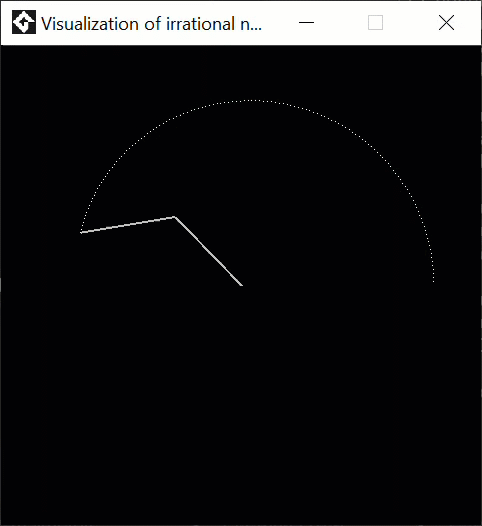
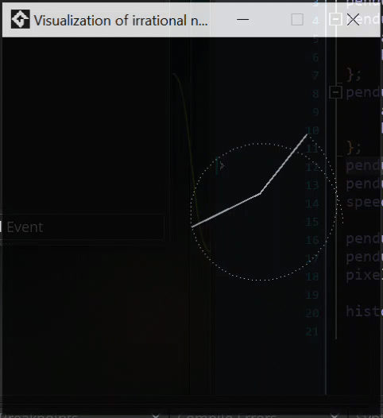
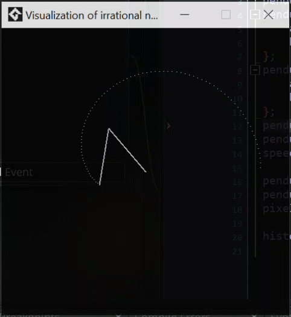
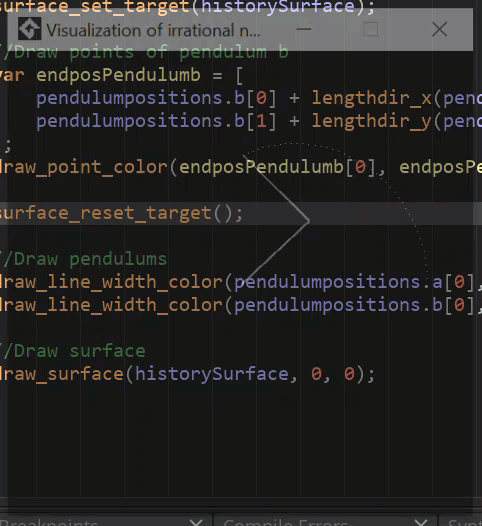
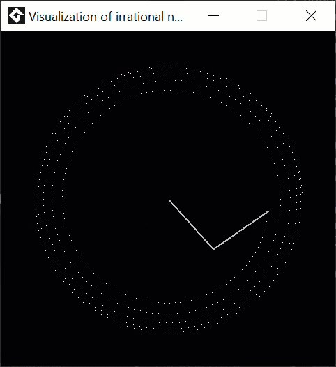
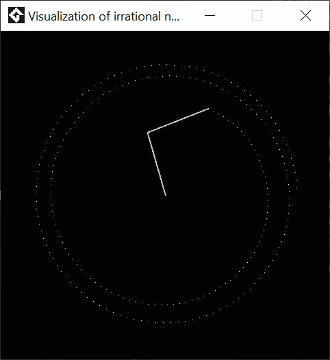
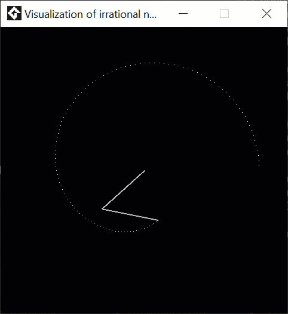
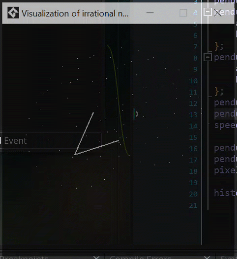
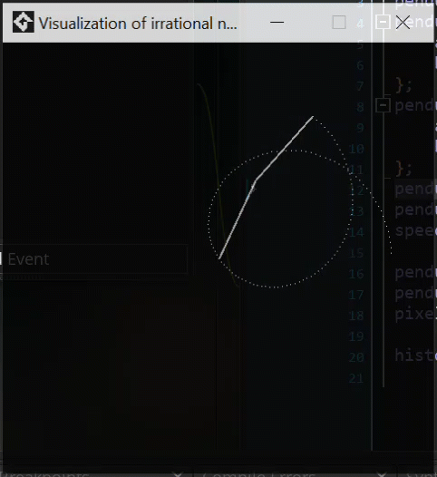

# Irrational Number Visualization in GameMaker

## Overview

This GameMaker project visualizes the behavior of **irrational numbers** using two spinning lines. One line rotates at a speed proportional to an irrational number (such as **π** or **√2**), while the other rotates at a regular speed. As the two lines spin, they trace out a shape that gradually forms a circle due to the constant misalignment between the two lines.

The goal of this visualization is to illustrate the **irrationality** of numbers like **π** and **√2** by showing how, over time, the difference in their rotational speeds causes the lines to never fully synchronize. If both lines rotated at speeds that were proportional to rational numbers, they would eventually align periodically. However, because one line rotates at an irrational speed, the two lines are always slightly misaligned, and this subtle difference becomes visually apparent over time.

## Theoretical Background

### Rational vs. Irrational Numbers

- A **rational number** is a number that can be expressed as the quotient of two integers (e.g., 1/2, 3/4). When two lines rotate at speeds proportional to rational numbers, their rotations are **periodic**, meaning they align after a certain number of rotations.

- An **irrational number** cannot be expressed as a simple fraction. Numbers like **π** and **√2** have infinite, non-repeating decimal expansions. When one line rotates at a speed proportional to an irrational number, its rotation is **non-periodic**, meaning the lines will never perfectly realign after a certain time. The constant misalignment caused by the irrational speed demonstrates the **incommensurability** (non-proportionality) of the two rotations.

### Visualization Goal

- As one line rotates at a speed proportional to an irrational number (e.g., π radians per second), and the other rotates at a constant speed, they gradually trace out a circle. This misalignment between the two lines reveals how irrational numbers behave over time. The irregularities in the circle formation demonstrate the **irrationality** of the number governing the faster-spinning line.



## Project Files

The project is divided into three main scripts:

1. **Create_0.gml** - Initializes the variables for the spinning lines and sets up surfaces for drawing.
2. **Step_0.gml** - Updates the angles of the lines based on their rotational speeds.
3. **Draw_0.gml** - Handles the rendering of the lines as they spin, showing their changing alignment.

## `Create_0.gml`

### Purpose

This script initializes the spinning lines' variables and prepares the drawing surface where the visualization will take place.

### Key Variables and Setup

- **Angle Variables**:
  - `theta1`, `theta2`: Initial angles for the two lines.
  - These angles will update based on the rotation speed of each line.

- **Rotational Speeds**:
  - `omega1`: Angular velocity (speed of rotation) of the first line. This is set to a **regular speed** (a rational number).
  - `omega2`: Angular velocity of the second line, which is proportional to an **irrational number** (e.g., **π** or **√2**). This ensures that the second line rotates at a non-periodic rate, leading to the gradual misalignment.
 
If the speeds of the lines are proportional (i.e., the ratio between them is a rational number), the visualization will lose its intended effect. Instead of continuously misaligning and demonstrating the irrationality of the speed, the lines will synchronize periodically, showing a repetitive pattern. This behavior contrasts with the non-repeating misalignment that occurs when one of the lines spins at a speed based on an irrational number:



- **Surface Setup**:
  - A surface is created to render the visualization efficiently.

### Initialization Code Example

```gml
theta1 = 0; // Initial angle of the first line
theta2 = 0; // Initial angle of the second line
omega1 = 0.05; // Regular angular velocity (rational)
omega2 = pi; // Irrational angular velocity (e.g., pi or sqrt(2))

// Create a surface for drawing the spinning lines
if (!surface_exists(line_surface)) {
    line_surface = surface_create(room_width, room_height);
}

```

## `Step_0.gml`

### Purpose

This script updates the angles of the two lines based on their respective angular velocities. The angles change over time, causing the lines to spin at their defined rates.

### Key Concepts

-   **Angle Update**:

    -   The angle of each line is updated by adding its respective angular velocity to the current angle. Since `omega2` is irrational, its rotations will never perfectly align with the line rotating at `omega1`.
-   **Circular Motion**:

    -   Each line is rotated around a central point (the origin). The angle `theta1` changes at a constant rate, while `theta2` changes at an irrational rate.

### Code Example

```gml
`// Update the angles
theta1 += omega1 * delta_time; // Line 1 with rational angular velocity
theta2 += omega2 * delta_time; // Line 2 with irrational angular velocity

// Keep the angles within the range [0, 2 * pi]
theta1 = fmod(theta1, 2 * pi);
theta2 = fmod(theta2, 2 * pi);`

```

## `Draw_0.gml`

### Purpose

This script handles the rendering of the spinning lines on the surface, visualizing their alignment and misalignment as they trace the circle. The drawing reflects the progressive misalignment due to the irrational rotation speed.

### Drawing Process

-   **Surface Drawing**:

    -   The visualization occurs on the pre-created surface, minimizing the need for redrawing the entire scene each frame.
-   **Line Rendering**:

    -   The positions of the ends of the lines are calculated using trigonometry based on the updated angles `theta1` and `theta2`.
    -   `draw_line()` functions are used to draw the lines from the center to their calculated positions.

### Drawing Code Example

```gml

`// Set the surface as the target for drawing
surface_set_target(line_surface);

// Calculate positions of the line ends
x1 = origin_x + length * cos(theta1);
y1 = origin_y + length * sin(theta1);
x2 = origin_x + length * cos(theta2);
y2 = origin_y + length * sin(theta2);

// Draw the lines
draw_line(origin_x, origin_y, x1, y1, c_white);
draw_line(origin_x, origin_y, x2, y2, c_red);

// Reset the drawing target
surface_reset_target();
```

The lines are drawn in different colors to highlight their individual movements and the effects of their different rotational speeds.

## More Examples


